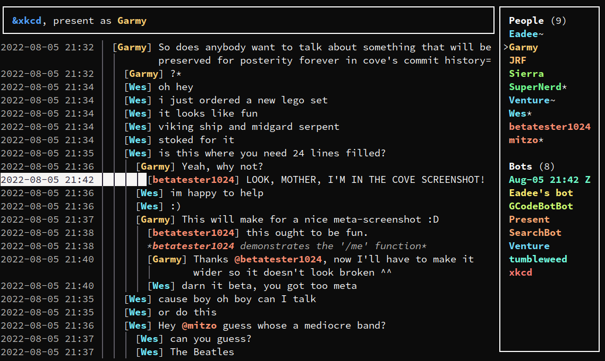

# cove

Cove is a TUI client for [euphoria.io](https://euphoria.io/), a threaded
real-time chat platform.



It runs on Linux, Windows and macOS.

## Using cove

To start cove, simply run `cove` in your terminal. For more info about the
available subcommands such as exporting room logs or resetting cookies, run
`cove --help`.

If you delete rooms, cove's vault (the database it stores messages and other
things in) won't automatically shrink. If it takes up too much space, try
running `cove gc` and waiting for it to finish. This isn't done automatically
because it can take quite a while.

## Manual installation

This section contains instructions on how to install cove by compiling it yourself.
It doesn't assume you know how to program, but it does assume basic familiarity with the command line on your platform of choice.
Cove runs in the terminal, after all.

### Installing rustup

Cove is written in Rust, so the first step is to install rustup. Either install
it from your package manager of choice (if you have one) or use the
[installer](https://rustup.rs/).

Test your installation by running `rustup --version` and `cargo --version`. If
rustup is installed correctly, both of these should show a version number.

Cove is designed on the current version of the stable toolchain. If cove doesn't
compile, you can try switching to the stable toolchain and updating it using the
following commands:
```bash
$ rustup default stable
$ rustup update
```

### Installing cove

To install or update to the latest release of cove, run the following command:

```bash
$ cargo install --force --git https://github.com/Garmelon/cove --branch latest
```

If you like to live dangerously and want to install or update to the latest,
bleeding-edge, possibly-broken commit from the repo's main branch, run the
following command.

**Warning:** This could corrupt your vault. Make sure to make a backup before
running the command.

```bash
$ cargo install --force --git https://github.com/Garmelon/cove
```

To install a specific version of cove, run the following command and substitute
in the full version you want to install:

```bash
$ cargo install --force --git https://github.com/Garmelon/cove --tag v0.1.0
```

## Config file

Cove's config file uses the [TOML](https://toml.io/) format.

When launched, cove prints the location it is loading its config file from. To
configure cove, create a config file at that location. This location can be
changed via the `--config` command line option.

The following is a complete list of available options. If a command line option
with the same purpose exists, it takes precedence over the option specified in
the config file.

### `data_dir`

**Type:** String (representing path)  
**Default:** Platform dependent

The directory that cove stores its data in when not running in ephemeral mode.

Relative paths are interpreted relative to the user's home directory.

See also the `--data-dir` command line option.

### `ephemeral`

**Type:** Boolean  
**Default:** `false`

Whether to start in ephemeral mode.

In ephemeral mode, cove doesn't store any data. It completely ignores any
options related to the data dir.

See also the `--ephemeral` command line option.

### `offline`

**Type:** Boolean  
**Default:** `false`

Whether to start in offline mode.

In offline mode, cove won't automatically join rooms marked via the `autojoin`
option on startup. You can still join those rooms manually by pressing `a` in
the rooms list.

See also the `--offline` command line option.

### `rooms_sort_order`

**Type:** String, one of `alphabetic`, `importance`  
**Default:** `alphabetic`

Initial sort order of rooms list.

`alphabetic` sorts rooms in alphabetic order.

`importance` sorts rooms by the following criteria (in descending order of
priority):

1. connected rooms before unconnected rooms
2. rooms with unread messages before rooms without
3. alphabetic order

### `euph.rooms.<room>.autojoin`

**Type:** Boolean  
**Default:** `false`

Whether to automatically join this room on startup.

### `euph.rooms.<room>.username`

**Type:** String  
**Default:** Not set

If set, cove will set this username upon joining if there is no username
associated with the current session.

### `euph.rooms.<room>.force_username`

**Type:** Boolean  
**Default:** `false`

If `euph.rooms.<room>.username` is set, this will force cove to set the username
even if there is already a different username associated with the current
session.

### `euph.rooms.<room>.password`

**Type:** String  
**Default:** Not set

If set, cove will try once to use this password to authenticate, should the room
be password-protected.
